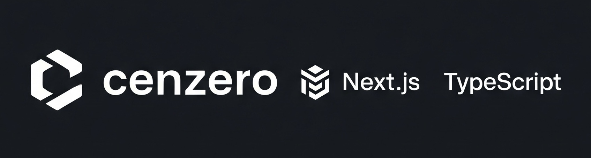

<p align="center">
  
</p>

# Cenzero Framework (cnzr)

A modern, minimalist yet powerful Node.js web framework built with TypeScript. Designed to be fast, developer-friendly, and feature-rich while maintaining simplicity. Competitive with Express.js, Fastify, and Hono.

[](https://www.npmjs.com/package/cnzr)
[](https://www.typescriptlang.org/)
[](https://opensource.org/licenses/MIT)

## 🚀 Features

### Core Framework
- 🎯 **Advanced Routing** - File-based routing with dynamic parameters `[id]` and catch-all `[...slug]`
- 🔧 **Dual Middleware** - Support for both legacy `(req, res, next)` and modern `(ctx, next)` patterns
- 🏗️ **Plugin System** - Extensible architecture with hooks (onRequest, onResponse, onError, etc.)
- 📦 **Context Object** - Rich context with request/response wrappers, state management, utilities
- 🍪 **Session & Cookies** - Built-in session management with secure defaults
- 🔒 **Security** - CORS, security headers, request validation
- � **Enhanced Logging** - Multi-level, colored output with request timing
- ❌ **Error Handling** - Comprehensive error management with custom handlers

### Developer Experience
- 🛠️ **Enhanced CLI** - Project scaffolding, development server, build tools
- 📁 **Static Files** - Efficient static file serving with caching
- 🎨 **Template Engine** - EJS and HTML template support
- � **Hot Reload** - Development server with automatic reloading
- 📊 **Performance** - Response time tracking, compression, optimizations
- 🌐 **Module Support** - Both ESM and CommonJS compatibility

### Built-in Plugins
- 🪵 **Logger** - Request/response logging with customizable formats
- 🌍 **CORS** - Cross-Origin Resource Sharing with full configuration
- ⏱️ **Response Time** - Automatic response time headers
- 🔐 **Security Headers** - Security-focused HTTP headers
- �️ **Compression** - Response compression (gzip/deflate)
- 🆔 **Request ID** - Unique request tracking

## 📦 Installation

```bash
npm install cnzr
```

## 🚀 Quick Start

### Create a new project

```bash
npx cnzr new my-app
cd my-app
npm install
npm run dev
```

### Manual setup

```typescript
import { CenzeroApp } from 'cnzr';

const app = new CenzeroApp();

// Modern context-based handler
app.get('/', (ctx) => {
  return ctx.json({ message: 'Hello from Cenzero!' });
});

// Legacy Express-style handler (also supported)
app.get('/legacy', (req, res) => {
  res.json({ message: 'Legacy style works too!' });
});

app.listen(3000);
```

## 📚 Documentation

### Context Object

The modern approach uses a rich context object that wraps request/response with additional utilities:

```typescript
app.get('/user/:id', (ctx) => {
  // Access request data
  const userId = ctx.params.id;
  const query = ctx.query;
  const body = ctx.body;
  
  // Session and cookies
  ctx.session.set('lastVisited', Date.now());
  ctx.cookies.set('userId', userId, { httpOnly: true });
  
  // State management
  ctx.state.user = { id: userId };
  
  // Response helpers
  return ctx.json({ success: true });
  // or ctx.html('<h1>Hello</h1>');
  // or ctx.redirect('/dashboard');
});
```

### Plugin System

Extend functionality with plugins:

```typescript
import { CenzeroApp, logger, cors, responseTime } from 'cnzr';

const app = new CenzeroApp();

// Built-in plugins
app.plugin(logger({ level: 'info', colorize: true }));
app.plugin(cors({ origin: 'https://example.com' }));
app.plugin(responseTime());

// Custom plugin
const customPlugin = {
  name: 'custom',
  hooks: {
    onRequest: (ctx) => {
      console.log('Request received:', ctx.req.url);
    },
    onResponse: (ctx) => {
      console.log('Response sent:', ctx.res.statusCode);
    }
  }
};

app.plugin(customPlugin);
```

### File-based Routing

Organize routes using the filesystem (Next.js style):

```
routes/
├── index.ts          // GET /
├── users/
│   ├── index.ts      // GET /users
│   ├── [id].ts       // GET /users/:id
│   └── [...slug].ts  // GET /users/* (catch-all)
└── api/
    └── auth.ts       // GET/POST /api/auth
```

```typescript
// routes/users/[id].ts
export default function handler(ctx) {
  const userId = ctx.params.id;
  return ctx.json({ user: { id: userId } });
}

// Also supports HTTP method exports
export async function GET(ctx) {
  return ctx.json({ method: 'GET' });
}

export async function POST(ctx) {
  return ctx.json({ method: 'POST', body: ctx.body });
}
```

### Session Management

```typescript
app.get('/profile', (ctx) => {
  // Get session data
  const user = ctx.session.get('user');
  
  if (!user) {
    return ctx.redirect('/login');
  }
  
  // Set session data
  ctx.session.set('lastAccess', new Date());
  
  return ctx.json({ user });
});

// Configure session options
const app = new CenzeroApp({
  session: {
    secret: 'your-secret-key',
    maxAge: 24 * 60 * 60 * 1000, // 24 hours
    secure: process.env.NODE_ENV === 'production'
  }
});
```

### Error Handling

```typescript
// Custom error handler
app.onError((error, ctx) => {
  console.error('Error:', error);
  
  if (error.status === 404) {
    return ctx.status(404).json({ error: 'Not found' });
  }
  
  return ctx.status(500).json({ error: 'Internal server error' });
});

// Throw HTTP errors
app.get('/protected', (ctx) => {
  if (!ctx.session.get('user')) {
    throw ctx.createError(401, 'Unauthorized');
  }
  
  return ctx.json({ data: 'protected' });
});
```

### Middleware

Support for both modern and legacy middleware patterns:

```typescript
// Modern context middleware
app.use((ctx, next) => {
  ctx.state.startTime = Date.now();
  return next();
});

// Legacy Express-style middleware
app.use((req, res, next) => {
  console.log(`${req.method} ${req.url}`);
  next();
});

// Route-specific middleware
app.get('/admin', authMiddleware, (ctx) => {
  return ctx.json({ admin: true });
});
```

### Built-in Middleware

```typescript
import { 
  loggerMiddleware, 
  createLoggerMiddleware,
  corsMiddleware, 
  createCorsMiddleware,
  corsWithOrigins,
  corsWithCredentials 
} from 'cnzr';

// Logger middleware - prints request logs
app.use(loggerMiddleware); // [GET] /users - 200 in 12ms

// Custom logger with options
app.use(createLoggerMiddleware({
  colors: true,
  timestamp: true,
  format: '[{timestamp}] {method} {url} - {status} in {ms}ms'
}));

// CORS middleware - basic (allow all origins)
app.use(corsMiddleware);

// CORS with custom configuration
app.use(createCorsMiddleware({
  origin: ['https://example.com', 'http://localhost:3000'],
  credentials: true,
  methods: ['GET', 'POST', 'PUT', 'DELETE']
}));

// CORS helper functions
app.use(corsWithOrigins(['https://trusted-domain.com']));
app.use(corsWithCredentials); // enables credentials
```

### Built-in Plugins

```typescript
import { logger, cors, responseTime, securityHeaders, compression, requestId } from 'cnzr/plugins';

// Logger with custom options
app.plugin(logger({
  level: 'info',
  colorize: true,
  format: 'json' // or 'combined'
}));

// CORS configuration
app.plugin(cors({
  origin: ['https://example.com', 'https://app.example.com'],
  credentials: true,
  methods: ['GET', 'POST', 'PUT', 'DELETE']
}));

// Add response time header
app.plugin(responseTime());

// Security headers
app.plugin(securityHeaders({
  contentSecurityPolicy: false // customize as needed
}));

// Response compression
app.plugin(compression({
  level: 6,
  threshold: 1024
}));

// Request ID tracking
app.plugin(requestId());
```

## 🔧 CLI Commands

### Create new project
```bash
cnzr new <project-name> [options]
  --template basic|advanced    # Project template
  --typescript                 # TypeScript project
  --git                        # Initialize git repository
```

### Development server
```bash
cnzr dev [options]
  --port <port>               # Server port (default: 3000)
  --host <host>               # Server host (default: localhost)
  --file-routing              # Enable file-based routing
```

### Build project
```bash
cnzr build [options]
  --output <dir>              # Output directory (default: dist)
  --esm                       # Build as ESM modules
  --cjs                       # Build as CommonJS modules
```

## 💡 Examples

### Modern API with Context

```typescript
import { CenzeroApp, logger, cors } from 'cnzr';

const app = new CenzeroApp();

// Add plugins
app.plugin(logger({ level: 'info' }));
app.plugin(cors());

// Modern context-based routes
app.get('/api/users/:id', (ctx) => {
  const userId = ctx.params.id;
  const user = ctx.session.get('user');
  
  if (!user) {
    throw ctx.createError(401, 'Unauthorized');
  }
  
  return ctx.json({ userId, user });
});

app.post('/api/users', async (ctx) => {
  const userData = ctx.body;
  
  // Validate and save user
  const newUser = await createUser(userData);
  
  return ctx.status(201).json(newUser);
});

app.listen(3000);
```

### File-based Routing

```bash
# Enable file-based routing
cnzr dev --file-routing

# File structure:
# routes/
# ├── index.ts          // GET /
# ├── users/
# │   ├── index.ts      // GET /users
# │   └── [id].ts       // GET /users/:id
# └── api/
#     └── auth.ts       // Multiple methods
```

```typescript
// routes/api/auth.ts
export async function POST(ctx) {
  const { email, password } = ctx.body;
  
  // Authenticate user
  const user = await authenticate(email, password);
  
  if (!user) {
    throw ctx.createError(401, 'Invalid credentials');
  }
  
  ctx.session.set('user', user);
  return ctx.json({ success: true, user });
}

export async function DELETE(ctx) {
  ctx.session.clear();
  return ctx.json({ success: true });
}
```

### Plugin Development

```typescript
// Custom plugin example
const rateLimitPlugin = (options = {}) => ({
  name: 'rate-limit',
  dependencies: ['request-id'], // Optional dependencies
  hooks: {
    onRequest: (ctx) => {
      const ip = ctx.req.ip;
      const count = getRequestCount(ip);
      
      if (count > options.max) {
        throw ctx.createError(429, 'Too Many Requests');
      }
      
      incrementRequestCount(ip);
    }
  }
});

app.plugin(rateLimitPlugin({ max: 100 }));
```

### Advanced Server Setup

```typescript
import { CenzeroApp } from 'cnzr';

const app = new CenzeroApp({
  port: 3000,
  host: '0.0.0.0',
  staticDir: 'public',
  viewEngine: 'ejs',
  viewsDir: 'views',
  session: {
    secret: process.env.SESSION_SECRET,
    maxAge: 24 * 60 * 60 * 1000, // 24 hours
    secure: process.env.NODE_ENV === 'production'
  }
});

// Custom error handler
app.onError((error, ctx) => {
  console.error('Error:', error);
  
  const status = error.status || 500;
  const message = process.env.NODE_ENV === 'production' 
    ? 'Internal Server Error' 
    : error.message;
    
  return ctx.status(status).json({ error: message });
});

// Global middleware
app.use((ctx, next) => {
  ctx.state.requestTime = Date.now();
  return next();
});

app.listen();
```

## 🆚 Framework Comparison

| Feature | Cenzero | Express | Fastify | Hono |
|---------|---------|---------|---------|------|
| TypeScript | ✅ First-class | ⚠️ Community | ✅ Built-in | ✅ Built-in |
| Context Object | ✅ Rich context | ❌ req/res only | ⚠️ Basic | ✅ Yes |
| Plugin System | ✅ Hook-based | ⚠️ Middleware | ✅ Plugin API | ⚠️ Middleware |
| File Routing | ✅ Built-in | ❌ Manual | ❌ Manual | ❌ Manual |
| Session/Cookies | ✅ Built-in | ⚠️ External libs | ⚠️ External libs | ⚠️ External libs |
| ESM Support | ✅ Native | ⚠️ Partial | ✅ Yes | ✅ Yes |
| Performance | 🚀 Fast | ⚠️ Moderate | 🚀 Very Fast | 🚀 Fast |
| Bundle Size | 📦 Small | 📦 Medium | 📦 Medium | 📦 Very Small |

## 🧪 Testing

```typescript
// Create test instance
import { CenzeroApp } from 'cnzr';

const app = new CenzeroApp();
app.get('/test', (ctx) => ctx.json({ test: true }));

// Test with your preferred testing library
// Example with Jest + supertest
import request from 'supertest';

test('GET /test', async () => {
  const response = await request(app.server)
    .get('/test')
    .expect(200);
    
  expect(response.body).toEqual({ test: true });
});
```

## 📈 Performance Tips

1. **Use Context Middleware**: Modern context pattern is more efficient
2. **Enable Compression**: Use built-in compression plugin
3. **File Routing**: Reduces runtime route resolution overhead
4. **Session Configuration**: Use memory store for development, Redis for production
5. **Static Files**: Configure proper caching headers
6. **Plugin Order**: Order plugins by frequency of use

## 🔧 Configuration

```typescript
// Complete configuration example
const app = new CenzeroApp({
  // Server settings
  port: process.env.PORT || 3000,
  host: process.env.HOST || '0.0.0.0',
  
  // Static files
  staticDir: 'public',
  staticOptions: {
    maxAge: '1d',
    etag: true
  },
  
  // Templates
  viewEngine: 'ejs',
  viewsDir: 'views',
  
  // Session configuration
  session: {
    secret: process.env.SESSION_SECRET,
    name: 'cenzero.sid',
    maxAge: 24 * 60 * 60 * 1000,
    secure: process.env.NODE_ENV === 'production',
    httpOnly: true,
    sameSite: 'strict'
  },
  
  // Security
  security: {
    poweredBy: false,
    hideTechStack: true
  }
});
```

## 🚀 Migration Guide

### From Express.js

Most Express.js code works out of the box:

```typescript
// Express
app.get('/users/:id', (req, res) => {
  res.json({ id: req.params.id });
});

// Cenzero (legacy mode)
app.get('/users/:id', (req, res) => {
  res.json({ id: req.params.id });
});

// Cenzero (modern mode)
app.get('/users/:id', (ctx) => {
  return ctx.json({ id: ctx.params.id });
});
```

### Key Differences

1. **Context Object**: Use `ctx` instead of separate `req`/`res`
2. **Return Values**: Modern handlers can return responses
3. **Error Handling**: Use `ctx.createError()` for HTTP errors
4. **Session/Cookies**: Built-in instead of external middleware

## 🤝 Contributing

1. Fork the repository
2. Create your feature branch (`git checkout -b feature/amazing-feature`)
3. Make your changes with proper tests
4. Commit your changes (`git commit -m 'Add amazing feature'`)
5. Push to the branch (`git push origin feature/amazing-feature`)
6. Open a Pull Request

## 📄 License

MIT License - see the [LICENSE](LICENSE) file for details.

## 👤 Author

**Muhammad Falih Afiq (cenzer0)**
- GitHub: [@cenzer0](https://github.com/cenzer0)

## 🙏 Acknowledgments

- Inspired by Express.js, Fastify, and Hono
- Built with ❤️ for the Node.js community
- Special thanks to all contributors

---

**Happy coding with Cenzero! 🚀**
